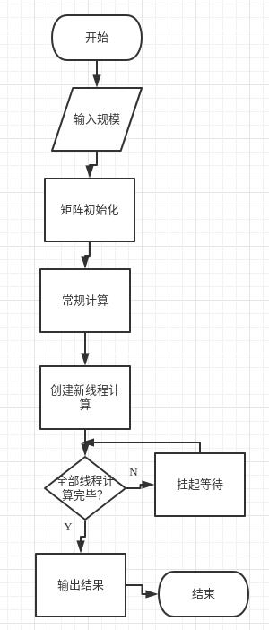
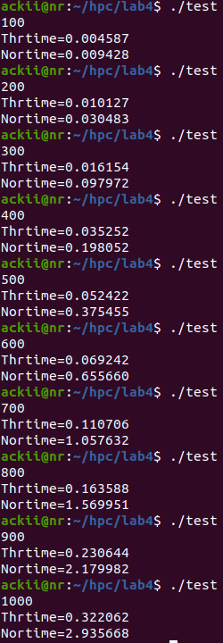
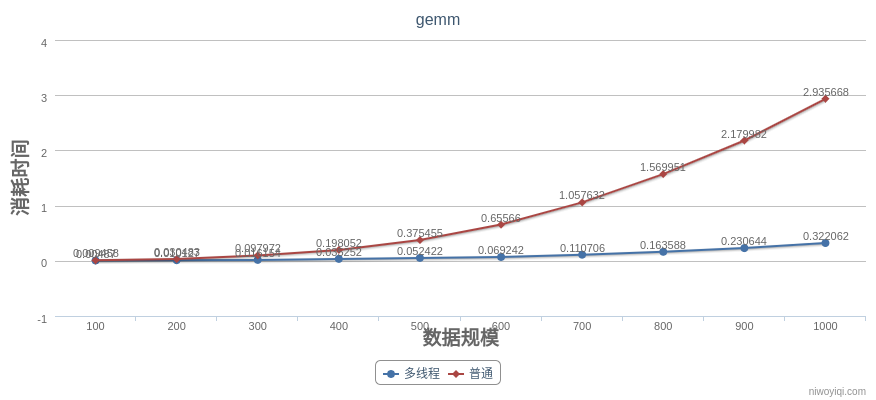

# 多线程优化矩阵乘法

> 元凯文 200110213

## 一、优化方法

对于规模为size的矩阵乘法，创建size个线程，每个线程计算一行结果。

```c
	pthread_t thrd[size];
	int row[size];
	for(int i = 0;i < size;++i)		//为防止引起线程间冲突建立row数组存放行号
		row[i] = i;
	gettimeofday(&startThr, NULL );
	for(int i = 0;i < size;++i){
		pthread_create(&thrd[i], NULL, (void *)ThrCal, &row[i]);
	}
	for(int i = 0;i < size;++i)
		pthread_join(thrd[i], NULL);	//挂起等待全部线程计算完毕
	gettimeofday(&endThr, NULL );
```

```c
//计算单行结果
void ThrCal(int *row)
{
	for(int k = 0;k < size;++k)
	{
		double sum = 0;
		for(int i = 0;i < size;++i)
			sum += A[*row][i] * B[i][k];
		CThr[*row][k] = sum;
	}	
	
	return;
}
```

## 二、流程图



## 三、运行结果





## 四、总结

在数据规模较小时，普通算法和多线程计算差距不大，随着数据规模增大，普通算法呈现$O（n^{3}）$时间复杂度增长，而多线程计算则明显优于普通算法。

