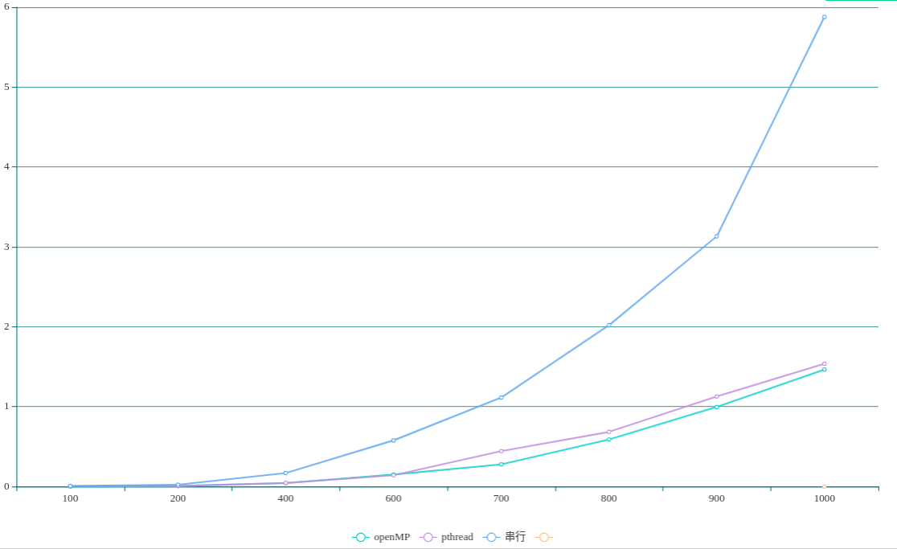
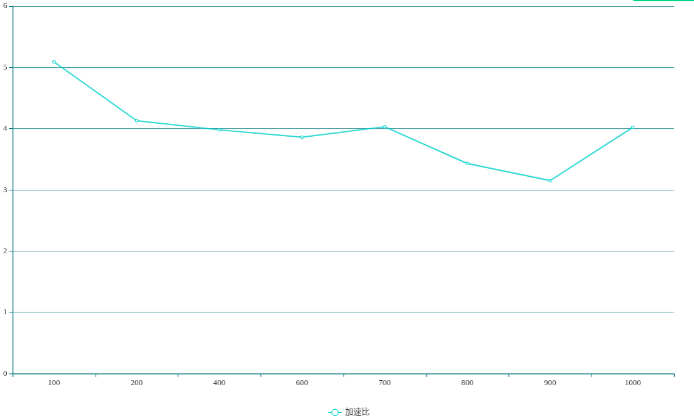

# openMP

> 元凯文 200110213

## 一、实验内容

使用openMP计算矩阵乘法(gemm)，并与pthread比较

## 二、设计方案

使用#pragma omp for对for循环进行优化

## 三、主要代码

```c
//openMP
    gettimeofday(&startOmp, NULL);
    #pragma omp num_thread(4) parallel shared(A,B,COmp)
    {
        #pragma omp for
        for (int i = 0; i < size; ++i) {
            for (int j = 0; j < size; ++j) {
                for (int k = 0; k < size; ++k) {
                    COmp[i][j] += A[i][k] * B[k][j];
                }
            }
        }
    }
```

## 四、实验数据与分析

原始数据见test.json（数据规模从10到1000，每10个点采样一次）





## 五、较pthread优势

1. 不需人工指定线程数量，可以较合理地根据可用处理器数量分配
2. 减少源代码复杂度和工程量